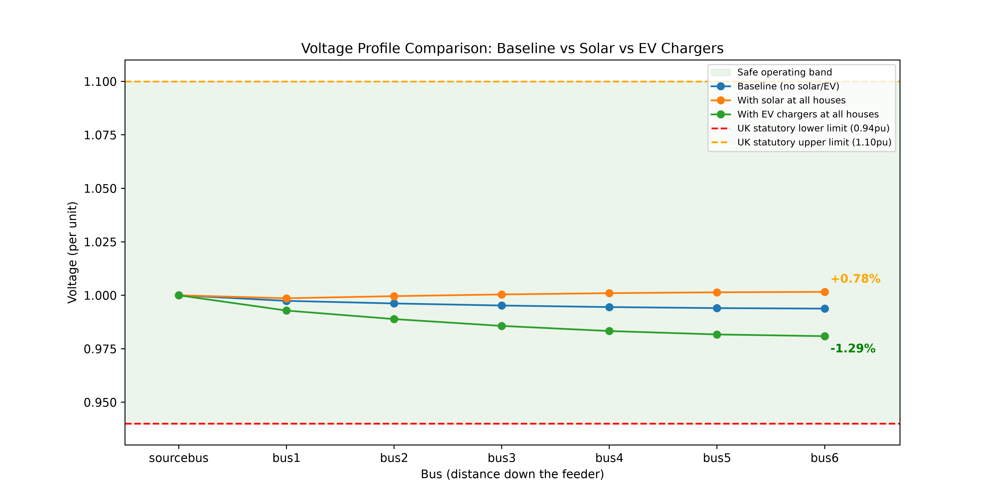

# UK LV Distribution Network Simulation (OpenDSS)

## Project Summary
This project simulates a small UK-style low-voltage (LV) residential distribution feeder using **OpenDSS**, the open-source power flow simulator built specifically for distribution networks and used by real UK Distribution Network Operators (DNOs) such as UKPN, National Grid ED, and SP Energy Networks. The network models one 11kV/415V distribution transformer feeding five houses along a single street cable, and analyses how voltage behaves under three scenarios: normal demand, high solar PV generation, and high EV charging demand, the kind of grid connection impact study DNOs run before approving new solar or EV connections on a street, checking results against the UK's statutory voltage limits (0.94–1.10 per unit, per ESQCR regulations).

## Aim / Objective
Simulate a small residential LV network and analyse:
- Baseline voltage drop across the feeder under normal household demand
- Voltage **rise** when solar PV is added at every house (a real, current UK DNO challenge as solar adoption grows)
- Voltage **drop** when EV chargers are added at every house (a real, current UK DNO challenge as EV adoption grows)
- Whether either scenario breaches UK statutory voltage limits (0.94–1.10 per unit, per ESQCR regulations)

## Results
| Scenario | Voltage at furthest house (bus6) | Change vs baseline |
|---|---|---|
| Baseline (no solar/EV) | 0.9938 pu | — |
| With solar PV at every house | 1.0016 pu | **+0.78%** |
| With EV chargers at every house | 0.9809 pu | **−1.29%** |

All three scenarios stayed within the UK's statutory voltage limits (0.94–1.10 pu), but the results clearly show the opposing effects solar and EV adoption have on network voltage — this is exactly the kind of study a DNO runs before approving new solar or EV connections on a street.



## Tools Used
- **OpenDSS** — the simulation engine itself (developed by EPRI)
- **Python** — controls OpenDSS via `py-dss-interface`, which wraps the official EPRI OpenDSS engine directly (chosen over the alternative `OpenDSSDirect.py` specifically so results reflect the exact engine UK DNOs themselves use)
- **Pandas** — handling and exporting voltage results as structured tables/CSVs
- **Matplotlib** — plotting voltage profiles and building the final comparison graph

## Tech Decisions
This project uses `py-dss-interface` rather than the more actively-maintained `OpenDSSDirect.py`, specifically because it interfaces with the **official EPRI OpenDSS engine** — the same engine real UK DNOs use — rather than a reimplementation. For a project meant to demonstrate DNO-relevant technical credibility, this was a deliberate trade-off: slightly less active maintenance and Windows-only support, in exchange for results that map directly to the industry-standard tool.

## Project Structure
```
opendss-distribution-network-uk/
├── data/
├── notebooks/
├── outputs/              # saved CSVs and voltage profile graphs
├── scripts/
│   ├── build_network.py       # baseline UK LV feeder model
│   ├── add_solar.py           # solar PV scenario
│   ├── add_EV_chargers.py     # EV charging scenario
│   └── compare_scenarios.py   # combined comparison graph
├── requirements.txt
└── README.md
```


## How to Run
```powershell
python -m venv venv
venv\Scripts\activate
pip install -r requirements.txt
python scripts/build_network.py
python scripts/add_solar.py
python scripts/add_EV_chargers.py
python scripts/compare_scenarios.py
```

## Short-Term Goals / Possible Extensions
- Test how many additional EV chargers the feeder could support before breaching the 0.94pu lower limit
- Model a longer feeder (more houses) to see how far voltage effects extend
- Combine solar AND EV scenarios together, to study a more complex real-world mix
- Refactor the network-building code into a shared reusable function across all three scenario scripts, to remove duplication